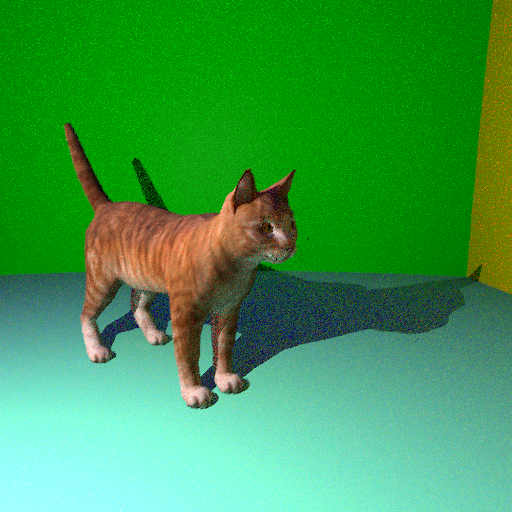

# Computer-Graphics

# 3D Ray Tracer with OBJ Model Support

This project implements a physically-based ray tracer capable of rendering 3D models in OBJ format with texture mapping. The renderer supports various material types including diffuse, mirror, and transparent surfaces, with both direct and indirect (global) illumination.



## Features

- **3D Model Support**: Loads and renders 3D models in OBJ format with proper texture mapping
- **Material System**: Handles diffuse, mirror, and transparent materials
- **Advanced Lighting**:
  - Direct illumination with shadows
  - Indirect illumination via Monte Carlo path tracing
  - Specular highlights for reflective surfaces
- **Rendering Techniques**:
  - Anti-aliasing using multiple samples per pixel
  - Gamma correction for accurate color representation
  - Barycentric coordinate interpolation for texture mapping
- **Optimization**:
  - Bounding box acceleration for faster ray-triangle intersection
  - Parallel rendering using OpenMP

## Dependencies

- [stb_image.h] stb_image.h - For loading image textures
- [stb_image_write.h] stb_image_write.h - For saving rendered images
- C++ compiler with C++11 support
- OpenMP (optional, for multi-threading)

## Building the Project

### macOS
```bash
g++ -O3 -fopenmp -o raytracer main.cpp -std=c++11
```


## Usage

1. Ensure you have the required OBJ model file and its associated textures in the same directory
2. The default scene renders a cat model with environment walls
3. Run the compiled executable:
   ```
   ./raytracer
   ```
4. The rendered image will be saved as `image6.png` in the current directory

## Input Files

- `cat.obj` - 3D model of a cat
- `cat_diff.png` - Diffuse texture map for the cat model
- Associated MTL files if referenced by the OBJ file

## Customization

You can modify the following parameters in the code:

- Image resolution: Change `W` and `H` variables (default: 512×512)
- Camera position: Modify `camera_origin` vector
- Camera angle: Adjust `camera_angle` variable
- Field of view: Change `fov` variable
- Scene elements: Add or remove objects in the `main()` function
- Rendering quality: 
  - Increase `n_rays` for better anti-aliasing
  - Increase `max_ray_depth` for more accurate indirect lighting
  - Adjust light intensity and position

## Implementation Details

### Ray Tracing Algorithm

The ray tracer uses a recursive algorithm to compute direct and indirect illumination:
1. Cast rays from the camera through each pixel
2. Find the nearest intersection with scene objects
3. For direct lighting, compute shadows and apply the shading model
4. For indirect lighting, cast random rays in the hemisphere and recursively trace them
5. Combine direct and indirect components with appropriate weights

### OBJ Model Loading

The renderer includes a custom OBJ loader that:
1. Loads geometry (vertices, normals, texture coordinates)
2. Loads and applies materials from MTL files
3. Loads texture images and applies them during rendering

### Acceleration Structures

Bounding boxes are used to accelerate ray-triangle intersection tests, significantly improving performance for complex 3D models.